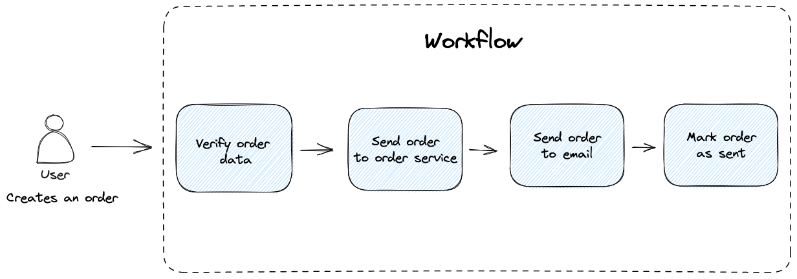

## Asynchronous Symfony workflows

This project demonstrates how Symfony workflow (state machine) might be used to split complex business logic into small pieces and ensure system reliability and fault tolerance.

Let's consider the flow: we create an order, send it to the order service, send it to user email and mark it as "sent".

All these actions should be executed successfully, but there are many points of failure: invalid order data during creation, order service or vendor email provider failure, etc



Symfony workflow with retry logic allows to execute the complex business flow even if there are any errors during execution:

- any business logic flow is divided into state-machine transitions. Every transition is executed transactionally.
- if transition execution failed we can retry it later by command or asynchronously.
- every transition contains only business logic and doesn't depend on the workflow implementation.
- a transition uses only two entities: `WorkflowEnvelope` and `WorkflowStampInterface` to apply data from previous transitions and pass its own result to the next steps.

As an example, an "Order" workflow is created. The example demonstrates how it's possible to retry the flow after failure:

```php
src/Service/Order/OrderService.php
```

## Symfony Workflow

At first, need to create a new [Symfony workflow](https://symfony.com/doc/current/workflow.html):

```yaml
framework:
  workflows:
    order_send:
      type: state_machine
      supports:
        - App\Entity\WorkflowEntry
      marking_store:
        type: 'method'
        property: 'currentState'
      places:
        - initialised
        - verified
        - approved
        - sent_to_email
        - marked_as_sent
      transitions:
        verify_order:
          from: initialised
          to: verified
        approve_order:
          from: verified
          to: approved
        send_order_to_email:
          from: approved
          to: sent_to_email
        mark_order_as_sent:
          from: sent_to_email
          to: marked_as_sent
```

## Core functionality

A workflow handles a ```App\Entity\WorkflowEntry``` object that keeps current and next states and store business logic data using stamps ```App\Service\Workflow\WorkflowStampInterface```.
Stamps are serialized in the Envelope ```App\Service\Workflow\Envelope\WorkflowEnvelope```.
The ```App\Entity\WorkflowEntry``` object is stored in database after every transition to allow resuming the process after failures.


```App\Service\Workflow\WorkflowHandler``` service starts a workflow and handles exceptions.

```App\Service\Workflow\EventSubscriber\WorkflowNextStateSubscriber``` and ```App\Service\Workflow\EventSubscriber\WorkflowTransitionSubscriber``` use Symfony workflow events to execute current transition, store result in the database and apply the next one.


There are exceptions that allows to control the workflow:

- ```App\Service\Workflow\Exception\StopWorkflowException``` - finally stops the workflow is some permanent error occurred

- ```App\Service\Workflow\Exception\WorkflowInternalErrorException``` - temporary stops the workflow to retry it later, for example, if 3rd party service is temporarily unavailable

- ```App\Service\Workflow\Exception\ProceedWorkflowInQueueException``` - temporary stops the workflow and send the retry process to a queue


## Transitions


To implement this flow let's add three transitions. Every transition must implement
```WorkflowTransitionInterface```.

```WorkflowTransitionInterface::handle``` method should contain transition implementation.

```WorkflowTransitionInterface::getNextTransition``` returns next transition value or null if current transition is the last one.

```WorkflowTransitionInterface::getState``` returns the flow state which should be set to the workflow entry after the transition is done

Check the ```src/Service/Workflow/Order/Transition``` directory for details.


**VerifyOrder**

```php
class VerifyOrder implements WorkflowTransitionInterface
{
    public function __construct(
        private readonly OrderRepository $orderRepository,
    ) {
    }

    public function handle(WorkflowEnvelope $envelope): WorkflowEnvelope
    {
        /** @var OrderIdStamp $orderIdStamp */
        $orderIdStamp = $envelope->getStamp(OrderIdStamp::class);
        $orderId = $orderIdStamp->getOrderId();

        $order = $this->orderRepository->find($orderId);
        ....
        return $envelope;
    }

    public function getNextTransition(): ?string
    {
        return Transition::ApproveOrder->value;
    }

    public function getState(): ?string
    {
        return State::Verified->value;
    }
}
```

**ApproveOrder**

```php
class ApproveOrder implements WorkflowTransitionInterface
{
    public function handle(WorkflowEnvelope $envelope): WorkflowEnvelope
    {
        ....
        return $envelope;
    }

    public function getNextTransition(): ?string
    {
        return Transition::SendOrderToEmail->value;
    }

    public function getState(): ?string
    {
        return State::Approved->value;
    }
}
```

**SendOrderToEmail**

```php
class SendOrderToEmail implements WorkflowTransitionInterface
{
    public function handle(WorkflowEnvelope $envelope): WorkflowEnvelope
    {
        ....
        return $envelope;
    }

    public function getNextTransition(): ?string
    {
        return Transition::MarkOrderAsSent->value;
    }

    public function getState(): ?string
    {
        return State::SentToEmail->value;
    }
}
```

**MarkOrderAsSent**

```php
class MarkOrderAsSent implements WorkflowTransitionInterface
{
    public function handle(WorkflowEnvelope $envelope): WorkflowEnvelope
    {
        ....
        return $envelope;
    }

    public function getNextTransition(): ?string
    {
        return null;
    }

    public function getState(): ?string
    {
        return State::MarkedAsSent->value;
    }
}
```

Because ```Symfony\Component\Workflow\Registry``` injection is deprecated it's convenient to group workflow transitions to the service locator:

```yaml
app.transitions:
    class: Symfony\Component\DependencyInjection\ServiceLocator
    tags: [ 'container.service_locator' ]
    arguments:
        -
            order_send.verify_order: '@App\Service\Workflow\Order\Transition\VerifyOrder'
            order_send.send_order: '@App\Service\Workflow\Order\Transition\SendOrder'
            order_send.mark_order_as_sent: '@App\Service\Workflow\Order\Transition\MarkOrderAsSent'
```
